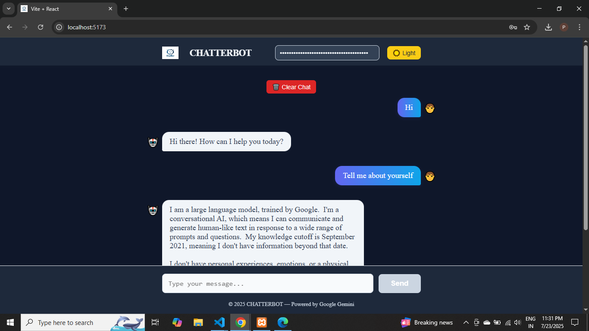

# Gemini Chatbot Application

A professional, ChatGPT-style chatbot web application built with **React (Vite)** for the frontend and **Flask** for the backend, powered by the Google Gemini API.

## Tech Stack
React.js / Flask / Python

## Features

- ChatGPT-like interface with dark mode
- All chat history shown in the current session
- Secure Gemini API key input (not stored)
- Modern, responsive design

---

## Prerequisites

- **Node.js** (v16+ recommended)
- **Python** (v3.8+ recommended)
- **pip** (Python package manager)
- A valid **Google Gemini API key**

---

## 1. Backend Setup (Flask)

1. **Navigate to the backend folder:**
   ```sh
   cd chatbot
   ```

2. **Install Python dependencies:**
   ```sh
   pip install flask flask-cors google-generativeai
   ```

3. **Run the Flask server:**
   ```sh
   python app.py
   ```
   The backend will start at [http://localhost:5000](http://localhost:5000).

---

## 2. Frontend Setup (React + Vite)

1. **Navigate to the frontend folder:**
   ```sh
   cd chatbot
   ```

2. **Install Node dependencies:**
   ```sh
   npm install
   ```

3. **Start the React development server:**
   ```sh
   npm run dev
   ```
   The frontend will start at [http://localhost:5173](http://localhost:5173) (default Vite port).

---

## 3. Usage

1. **Open the frontend in your browser:**  
   [http://localhost:5173](http://localhost:5173)

2. **Enter your Gemini API key** in the top input field.

3. **Start chatting!**  
   Type your message and press **Send** or hit **Enter**.

---

## Notes

- The API key is required for every session and is never stored.
- Make sure the Flask backend is running before using the frontend.
- You can customize the look and feel by editing `App.jsx`.

---

## Project Structure

```
chatbot/
├── app.py           # Flask backend
├── package.json     # React frontend dependencies
├── src/
│   └── App.jsx      # Main React component
└── ...
```

---

## License

This project is for educational and personal use only.
